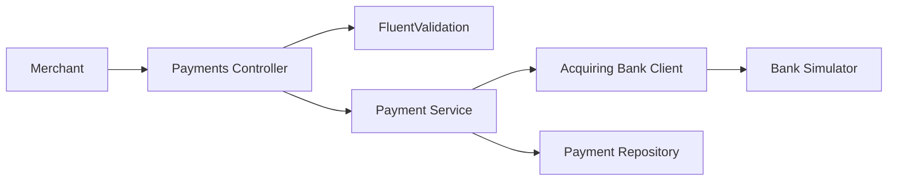

# Payment Gateway

A .NET 8 API that validates card payments, sends valid requests to the supplied acquiring-bank simulator, and retrieves previously processed payments. The implementation is deliberately small and focused on the [assessment requirements](CHALLENGE.md).

## Architecture



The API exposes:

- `POST /api/payments` to process a payment.
- `GET /api/payments/{id}` to retrieve a processed payment.

Authorized and declined payments return `200 OK`. Invalid requests return `400 Bad Request` without calling the bank. Unknown payments return `404 Not Found`, known bank failures return `502 Bad Gateway`, and unexpected failures return a sanitized `500 Internal Server Error`. Errors use `application/problem+json` and include a trace ID.

## Running the service

Start the gateway and bank simulator with Docker:

```bash
docker compose up --build
```

With Compose, the API is available at `http://localhost:5000` and Swagger UI at `http://localhost:5000/swagger`.

To run the API with the SDK while the simulator runs in Docker:

```bash
docker compose up bank_simulator
dotnet run --project src/PaymentGateway.Api
```

The SDK launch profile uses `http://localhost:5067` and `https://localhost:7092`; port `5000` is only the Compose host port. The bank URL and timeout can be overridden with `AcquiringBank__BaseUrl` and `AcquiringBank__TimeoutSeconds`. Timeout must be between 1 and 120 seconds or startup fails.

## Assumptions

- Invalid payment details produce a `400 Bad Request` with payment status `Rejected`; no payment is stored and the bank is not called.
- `Authorized` and `Declined` are successful bank outcomes and are both stored for retrieval.
- A card remains valid through the end of its stated expiry month, evaluated using UTC.
- Supported currencies are exactly `GBP`, `USD`, and `EUR`.
- Amount is a positive integer in the currency's minor unit.
- Card numbers and CVVs contain ASCII digits only. CVV is a string so leading zeroes are preserved.
- The gateway stores only the last four card digits. PAN, CVV, and bank authorization codes are not retained.
- Automatic bank retries are omitted because payments are not safely retryable without an idempotency contract.

## Design

### API and configuration

`Program.cs` contains only the high-level startup sequence. Internal configuration extensions register logging, API behavior, application dependencies, Swagger, Problem Details, and health endpoints.

`PaymentsController` owns HTTP concerns: validation responses, status codes, Problem Details, and mapping internal payment data to the public response.

### Validation

`PaymentRequestValidator` contains the input rules using FluentValidation. It depends on `TimeProvider`, allowing expiry boundaries to be tested against a fixed clock while production uses `TimeProvider.System`.

### Payment service

`PaymentService` coordinates the workflow. It maps the API request to the bank contract, calls the bank client, converts the bank decision into `Authorized` or `Declined`, creates a gateway ID, and stores a safe payment model.

### Acquiring-bank client

The typed `HttpClient` owns the external JSON contract and validates successful responses. Network errors, timeouts, and invalid bank responses are classified with a typed failure enum. Caller cancellation is propagated separately from an `HttpClient` timeout.

### Repository and models

`IPaymentRepository` is implemented by an in-memory `ConcurrentDictionary`, as permitted by the brief. It supports concurrent requests but is intentionally non-durable and suitable only for this exercise.

API, bank, and stored payment models are separate at their boundaries. Only the small safe `PaymentModel` is shared by the service and repository, avoiding unnecessary read/write model duplication.

### Logging and delivery

Logs use structured properties and exclude card numbers, CVVs, authorization codes, and raw bodies. Development uses single-line console logs; other environments use JSON logs with UTC timestamps and trace/span correlation. Availability failures are warnings, invalid dependency responses and unexpected failures are errors, and normal payment outcomes are informational.

The solution includes liveness and readiness routes, a multi-stage Dockerfile, Docker Compose configuration, Swagger, and a GitHub Actions build/test/container pipeline.

## Testing

Run the suite with:

```bash
dotnet test PaymentGateway.sln --configuration Release
```

Alternatively, run the .NET 8 Docker test stage:

```bash
docker build --target test .
```

The test approach combines:

- Validator tests for field rules, boundary values, deterministic expiry checks, and independent validation paths.
- Service tests for request mapping, authorized/declined outcomes, persistence, cancellation, failure behavior, and safe structured logging.
- Bank-client tests for the exact HTTP/JSON contract, network failures, timeouts, cancellation, and malformed responses.
- Repository tests for concurrent access and duplicate identifiers.
- Startup tests proving invalid bank timeout configuration prevents the host from starting.
- Controller and application tests for response mapping, Problem Details, sensitive-data protection, routing, health, Swagger, and the complete process-then-retrieve flow. A focused integration set retains the production bank client and replaces only its HTTP transport.

Time, network transport, and the acquiring bank are replaced with small explicit test doubles. CI uses Coverlet to enforce at least 85% total line and branch coverage and uploads the Cobertura report.

## Future improvements

For a production payment system, the next priorities would be:

- Merchant authentication, authorization, and payment ownership.
- Durable encrypted storage with migrations, audit history, and retention controls.
- Idempotency keys, explicit processing states, and reconciliation for ambiguous bank outcomes.
- Safe resilience policies such as circuit breakers and bounded concurrency; retries only after idempotency is established.
- Low-cardinality payment and dependency metrics, SLO-based alerts, and OpenTelemetry export.
- Distinct production readiness checks for critical internal dependencies.
- API versioning, stable machine-readable error codes, rate limiting, and signed webhooks.
- Additional acquiring-bank adapters behind a routing strategy.
- Extract shared response or Problem Details mapping only if additional endpoints create meaningful duplication.
